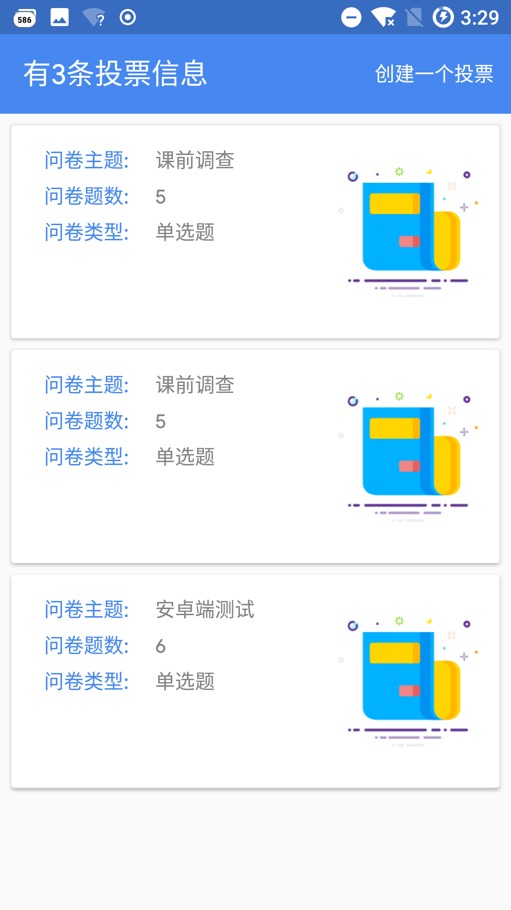

**⚠️WARN: All the Icon & Image was downloaded from iconfont.cn/ &dribbble.com.Due to legal issues📖, please don't use any of images or icons in commerical project.thanks...**

**注意：本项目图标和图片均从网络下载，请勿用于商业项目**

# 轻课

## 介绍 Description:

| 听说  | 用表格排版更好看                                             |
| ----- | ------------------------------------------------------------ |
| 😊介绍 | 一个教学辅助类Android应用，力图解决大学生课堂跟教师的交流问题，让课堂更加效率。 |
| ⭕️进度 | 仍在缓慢更新制作维护中。。。                                 |
| 🚪分工 | 1.Android客户端：我& [@TanXinKui](https://github.com/TanXinKui) 2.后端和服务器提供：我 |
| ❓问题 | 由于第一次做后端，没有多少经验，比较简单的一个后端           |

👽后端代码：

- [EasyCourse-Back-End](https://github.com/zhaoweih/4S-T-Back-End)

  🌈已删除数据库密码，如要运行请先在LoadConfig.java里填入自己的数据库密码，默认帐户是root

- 数据库sql文件:[mydatabase.sql](./sql/mydatabase.sql)

## 预览版本 Preview APK file:
[Google Drive](https://drive.google.com/file/d/1cObfceAaLpYykKcX1yn5dlhKGv9Hqy87/view?usp=sharing)

## 预览图 Preview:

先放几张预览图，非最终成品

| preview.Vote.show         | preview.Vote.result       |
| ------------------------- | ------------------------- |
|  |  |
| Preview .my               | Preview .courseManagement |
|      |    |

## 特别感谢:

特别感谢以下开源项目

- [Blade](https://github.com/lets-blade/blade) -  Lightning fast and elegant mvc framework for Java8 

## 有问题? 

- 发至邮箱：zhaoweihao.dev#gmail.com